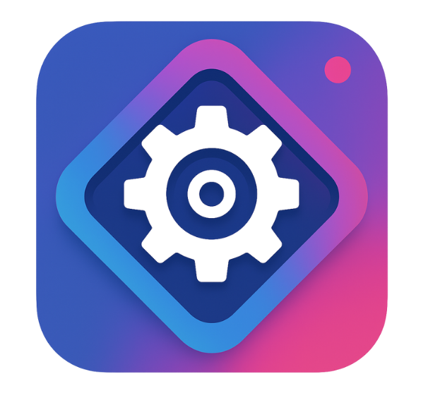
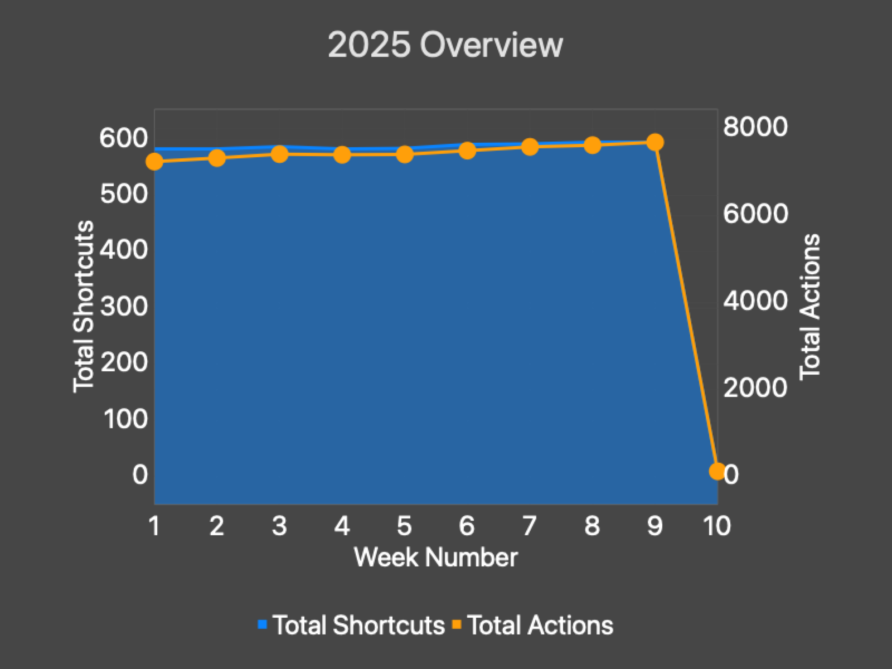

  

  <h1><a href="https://shortcutomation.com">Shortcutomation</a></h1>
  
  <h3>
    Automate the Boring Stuff with  Apple Shortcuts
  </h3>
  
  • • • • •
     
   • • • •
     
    • • •
     
		 • •
     
		  •

  <h3>
    <a href="https://shortcutomation.com/gallery">
      <strong>💁🏽 Explore & Download FREE Shortcuts »</strong>
    </a>
  </h3>
  
✨ ⸻ • ⸻ • ⸻ • ⸻ ✨

  

    <strong>Last Update:</strong> 2025-04-14
     
    Created by
    <a href="https://github.com/huaminghuangtw">Hua-Ming Huang</a>
    with 🌶️ in
    <a href="https://www.google.com/maps/place/L%C3%BCneburg,%20Germany">Lᴜ̈ɴᴇʙᴜʀɢ, Gᴇʀᴍᴀɴʏ</a>
  

  
  

    
     
    
     
    
  

  
  <h4>
    <a href="https://shortcutomation.com/blog">📖 Read Blog</a>
     • 
    <a href="https://github.com/huaminghuangtw/Shortcutomation/issues/new?labels=bug&template=bug-report---.md">🐛 Report Bug</a>
     • 
    <a href="https://github.com/huaminghuangtw/Shortcutomation/issues/new?labels=enhancement&template=feature-request---.md">🌟 Request Shortcut</a>
  </h4>

[![Contributors][contributors-shield]][contributors-url]
[![Forks][forks-shield]][forks-url]
[![Stargazers][stars-shield]][stars-url]
[![Issues][issues-shield]][issues-url]

| If you found this project helpful, consider [giving it a star ⭐](https://github.com/huaminghuangtw/Shortcutomation)   and sharing it with your fellow Apple power users — thank you for the support! 🫶 |
| :-: |

## 🚀 Quickstart

1. Visit the [Gallery](https://shortcutomation.com/gallery).

2. Choose a category that interests you:
   - **Recommended:** Start with **[Standalone Fun](https://shortcutomation.com/gallery/standalone%20fun)** — these shortcuts run immediately without any setup.
   - For other categories, check the **Dependencies** and **Required Apps** sections on each shortcut's page to get everything you need.

3. On each shortcut page, you'll find three helpful buttons:
   - **Preview Shortcut**
   - **Download Shortcut**
   - **View Source Code** (on GitHub)

4. Add to your device instantly — no account needed!

## 📊 Gallery Fun Stats

### 👀 At A Glance

* There are **600** Shortcuts with a total of **8739** actions across **71** categories.
* On average, each Shortcut has **15** actions.
* A typical Shortcut contains around **9** or more actions.

### 🏅 Top 5 Most Complex Shortcuts

  

  
  | Rank | Shortcut Name | Number of Actions |
  | :---: | :---: | :---: |
  | 1️⃣ | [_EvergreenList2Markdown](https://shortcutomation.com/gallery/Getting%20Things%20Done/_EvergreenList2Markdown) | 154 |
  | 2️⃣ | [5::Share Deep Work Stats](https://shortcutomation.com/gallery/Automation%20-%20Monthly/5::Share%20Deep%20Work%20Stats) | 119 |
  | 3️⃣ | [Backup Shortcuts](https://shortcutomation.com/gallery/Shortcutomation/Backup%20Shortcuts) | 108 |
  | 4️⃣ | [When turning my focus mode on](https://shortcutomation.com/gallery/Automation%20Modules/When%20turning%20my%20focus%20mode%20on) | 88 |
  | 5️⃣ | [🌷 Share Brain Food](https://shortcutomation.com/gallery/Getting%20Things%20Done/%F0%9F%8C%B7%20Share%20Brain%20Food) | 83 |

  

### 🎖️ Top 5 Largest Shortcuts
  
  

    
  | Rank | Shortcut Name | File Size (KB) |
  | :---: | :---: | :---: |
  | 1️⃣ | [Show Year Progress](https://shortcutomation.com/gallery/Getting%20Things%20Done/Show%20Year%20Progress) | 1697 |
  | 2️⃣ | [Year Progress](https://shortcutomation.com/gallery/Standalone%20Fun/Year%20Progress) | 1693 |
  | 3️⃣ | [iPhone Alarm Ringtone](https://shortcutomation.com/gallery/Sound%20Files/iPhone%20Alarm%20Ringtone) | 423 |
  | 4️⃣ | [Water Eject](https://shortcutomation.com/gallery/Standalone%20Fun/Water%20Eject) | 192 |
  | 5️⃣ | [Time's Up!](https://shortcutomation.com/gallery/Sound%20Files/Time's%20Up!) | 125 |

  

### 🔭 Overview Of This Year

    <a href="https://chartyios.app">
        <kbd>
            
        </kbd>
    </a>

## 👋 Contributing

**Contributions are always welcome!**

If you have any new shortcut or automation idea, feel free to [fork the repository](https://github.com/huaminghuangtw/Shortcutomation/fork) and [submit a pull request](https://github.com/huaminghuangtw/Shortcutomation/compare).

See [CONTRIBUTING.md](./CONTRIBUTING.md) for full guidelines and helpful tips to get started.

Alternatively, you can [open an issue](https://github.com/huaminghuangtw/Shortcutomation/issues/new?labels=enhancement&template=feature-request---.md) to suggest a shortcut or automation idea.

## 📄 License

This project is licensed under the [MIT License](LICENSE).

All contributed shortcuts and content are shared freely under the terms of the MIT License. Use them however you like—just give credit.

## 👋 Contact

**Hua-Ming Huang**  
📧 [huaming.huang.tw@gmail.com](mailto:huaming.huang.tw@gmail.com)  
🐦 [@huaminghuangtw](https://x.com/huaminghuangtw)

## 📦 Related

_[🔗 Check out my other project →](https://github.com/huaminghuangtw/Scriptable) for customizable notifications and widgets built with [Scriptable](https://scriptable.app)!_

## 💎 Acknowledgements

This library wouldn't be possible without the [r/shortcuts](https://www.reddit.com/r/shortcuts) community (especially [@gluebyte](https://www.reddit.com/user/gluebyte) 😉) and the following complementary apps:

1. [One Sec](https://one-sec.app/)
2. [a-Shell](https://holzschu.github.io/a-Shell_iOS)
3. [Charty](https://chartyios.app)
4. [Tapo](https://apps.apple.com/us/app/tp-link-tapo/id1472718009)
5. [ChatGPT](https://openai.com/chatgpt/overview)
6. [Working Copy](https://workingcopy.app)
7. [Arc Browser](https://arc.net)
8. [Microsoft Edge](https://www.microsoft.com/edge)
9. [Pushcut](https://www.pushcut.io)
10. [Audible](https://www.audible.com)
11. [Actions](https://sindresorhus.com/actions)
12. [Toolbox Pro](https://toolboxpro.app)
13. [Caffeinated](https://caffeinated.app)
14. [Any Text](https://sindresorhus.com/any-text)
15. [Scriptable](https://scriptable.app)
16. [Text Case](https://textcase.app)
17. [Timer RH](https://red-hot-timer-for-mac-os-x.3bitlab.com)
18. [Data Jar](https://datajar.app)

[contributors-shield]: https://img.shields.io/github/contributors/huaminghuangtw/Shortcutomation.svg?style=for-the-badge
[contributors-url]: https://github.com/huaminghuangtw/Shortcutomation/graphs/contributors
[forks-shield]: https://img.shields.io/github/forks/huaminghuangtw/Shortcutomation.svg?style=for-the-badge
[forks-url]: https://github.com/huaminghuangtw/Shortcutomation/network/members
[stars-shield]: https://img.shields.io/github/stars/huaminghuangtw/Shortcutomation.svg?style=for-the-badge
[stars-url]: https://github.com/huaminghuangtw/Shortcutomation/stargazers
[issues-shield]: https://img.shields.io/github/issues/huaminghuangtw/Shortcutomation.svg?style=for-the-badge
[issues-url]: https://github.com/huaminghuangtw/Shortcutomation/issues
